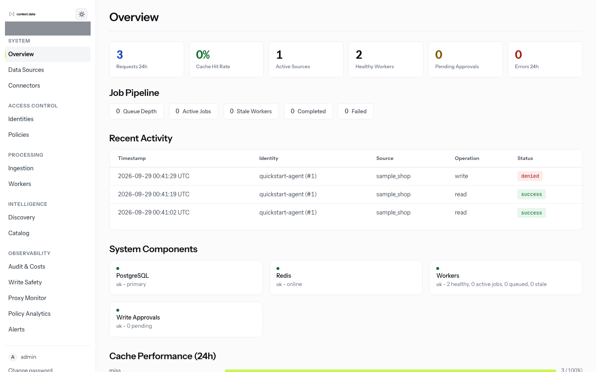

# InterLock

InterLock is a proxy between AI agents and the data they use. Agents connect to
it instead of to your databases and APIs, over protocols they already speak:
the PostgreSQL wire protocol, HTTP, and MCP. Every request is authenticated,
authorized by source roles, shaped by policy, redacted, and audited. Risky
writes wait for a person to approve them.

Agents don't change. Data stores don't change. You get one place that decides
what each agent may do, and a record of everything it did.

<picture>
  <source media="(prefers-color-scheme: dark)" srcset="docs-site/src/assets/screenshots/dark/overview.png">
  
</picture>

## What it does

- **Identities and keys** for each agent, stored as peppered hashes, rotated and
  revoked from the console.
- **Source roles** that allow or deny actions per source, down to tables and
  columns for SQL sources. SQL is parsed with `sqlglot`; nothing a role does not
  allow gets through.
- **Policies** that deny, redact, rate-limit or cap the risk of writes on top of
  what roles allow. They never grant access.
- **Write approval**: writes are classified by risk, and medium or high risk ones
  are queued for a reviewer instead of running.
- **Redaction** of PII in responses, by content and by named column.
- **Audit** of every request, allowed or denied, and of every admin action.
- **Connectors** for PostgreSQL, MySQL, S3, Slack, GitHub, HTTP APIs and more,
  a catalog of each source's structure, discovery across sources, and caching
  that never serves one identity another's answer.

## Quick start

```bash
docker compose --profile quickstart up -d --wait
```

Open http://127.0.0.1:9090 and sign in as `admin` with the password `admin`;
you are asked to choose a new one straight away. The
[quick start](docs-site/src/content/docs/get-started/quick-start.mdx) then walks
a sample database from registration to a governed, redacted, audited query.

## Documentation

The documentation is published at **https://interlock.contextdata.dev**, built
from [`docs-site/`](docs-site) (`make docs-build` to build it locally). Start
with:

| | |
|---|---|
| [What is InterLock](docs-site/src/content/docs/get-started/what-is-interlock.mdx) | what it does and what it does not |
| [Quick start](docs-site/src/content/docs/get-started/quick-start.mdx) | a first governed query in about ten minutes |
| [Setup walkthrough](docs-site/src/content/docs/get-started/setup-walkthrough.md) | every step of a real setup |
| [Concepts](docs-site/src/content/docs/concepts/architecture.md) | architecture, the request pipeline, roles, policies, audit |
| [Connect an agent](docs-site/src/content/docs/guides/connect-an-agent/mcp-clients.md) | Claude Code and MCP, PostgreSQL clients, HTTP |
| [Deploy with Helm](docs-site/src/content/docs/operations/deploy-with-helm.md) | Kubernetes, and the [production checklist](docs-site/src/content/docs/operations/production-checklist.md) |
| [Security model](docs-site/src/content/docs/concepts/security-model.md) | what InterLock protects, and the limits of that |
| [Contracts](docs-site/src/content/docs/reference/contracts/index.md) | what V1 promises, normatively |

## Status

InterLock is in release candidates for 1.0. What is stable, beta, disabled or
planned is in [feature status](docs-site/src/content/docs/reference/feature-status.md),
with its evidence; the [connector support matrix](docs-site/src/content/docs/reference/connector-support-matrix.md)
and [known limitations](docs-site/src/content/docs/reference/known-limitations.md)
say what has been certified and what has not. The gates a release must pass are
in the [release process](docs-site/src/content/docs/project/release-process.md),
and every change is in the [changelog](CHANGELOG.md).

## Contributing and security

See [CONTRIBUTING.md](CONTRIBUTING.md). Report vulnerabilities privately, never
in a public issue: [SECURITY.md](SECURITY.md).

## License

InterLock is licensed under the Apache License, Version 2.0. See
[LICENSE](LICENSE), and [NOTICE](NOTICE) for third-party components.
